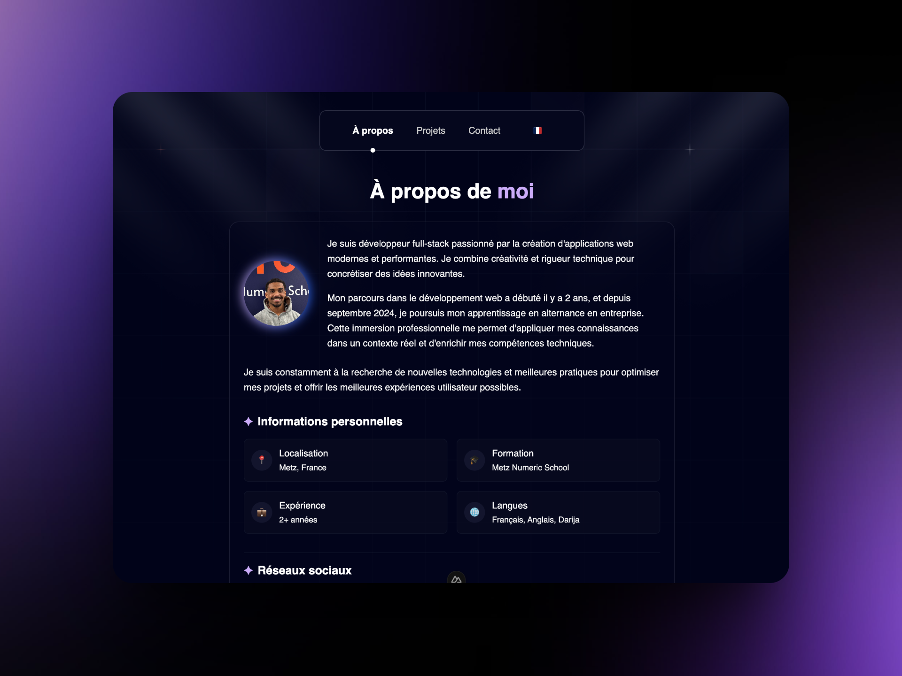

# Portfolio

Welcome to my personal portfolio project! This project showcases my skills, projects, and professional experiences in web development. It is designed to provide a smooth and responsive user experience with a modern and accessible design.

## Table of Contents

- [Introduction](#introduction)
- [Features](#features)
- [Technologies Used](#technologies-used)
- [Contact](#contact)
- [License](#license)

## Introduction

Hello! I'm Mehdi DIAS GOMES, a young full-stack developer passionate about creating modern and high-performance web applications. This portfolio is designed as a showcase of my web development skills. I developed this site using Nuxt.js and TypeScript to provide a smooth and responsive user experience, with a modern and accessible design.

## Features

- **Responsive Design**: The interface is adapted to all devices, ensuring a seamless experience on desktops, tablets, and mobile phones.
- **Multilingual Support**: The portfolio supports multiple languages (French/English) using i18n.
- **Smooth Animations**: Enhanced user experience with smooth animations and transitions.
- **Interactive Elements**: Includes interactive elements like buttons and scroll animations to engage users.

## Technologies Used

- **Frontend**: Vue.js, Nuxt.js, TypeScript
- **Styling**: Tailwind CSS
- **Animations**: Animate.css
- **Localization**: Vue I18n
- **Icons**: Lucide Icons

## Contact

Do you have a project in mind or a question? Feel free to contact me through the contact form available on the portfolio, and I will respond to you as soon as possible.

- **Location**: Metz, France
- **Education**: Metz Numeric School
- **Experience**: 2+ years
- **Languages**: French, English, Darija

## License

This project is licensed under the MIT License. See the [LICENSE](LICENSE.md) file for more details.

---

Thank you for visiting my portfolio! If you have any feedback or suggestions, feel free to reach out.
